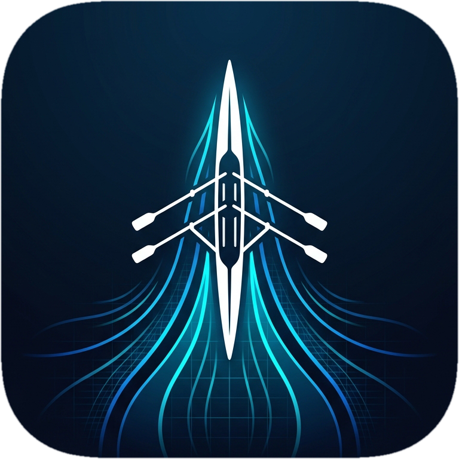
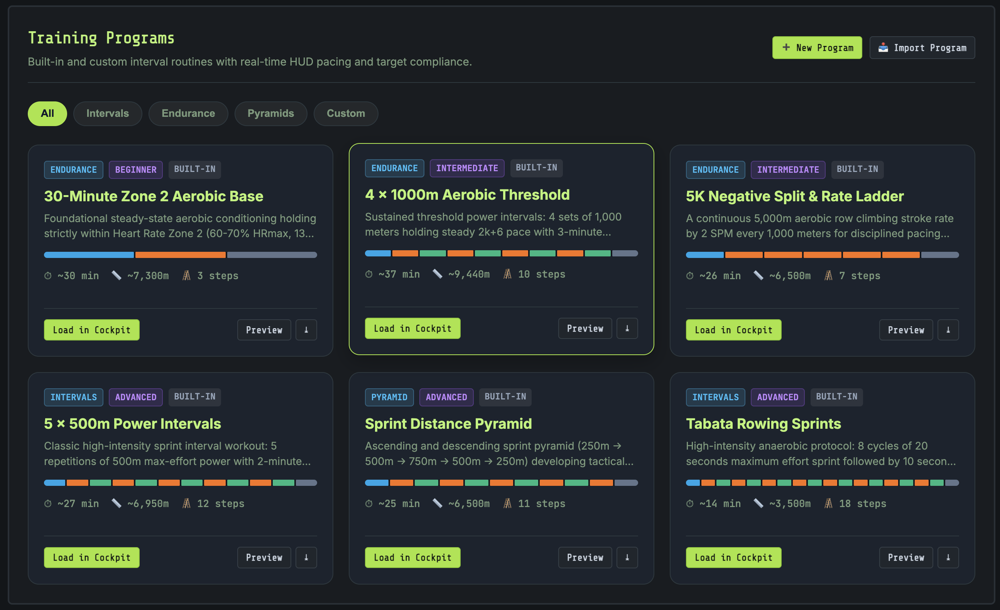
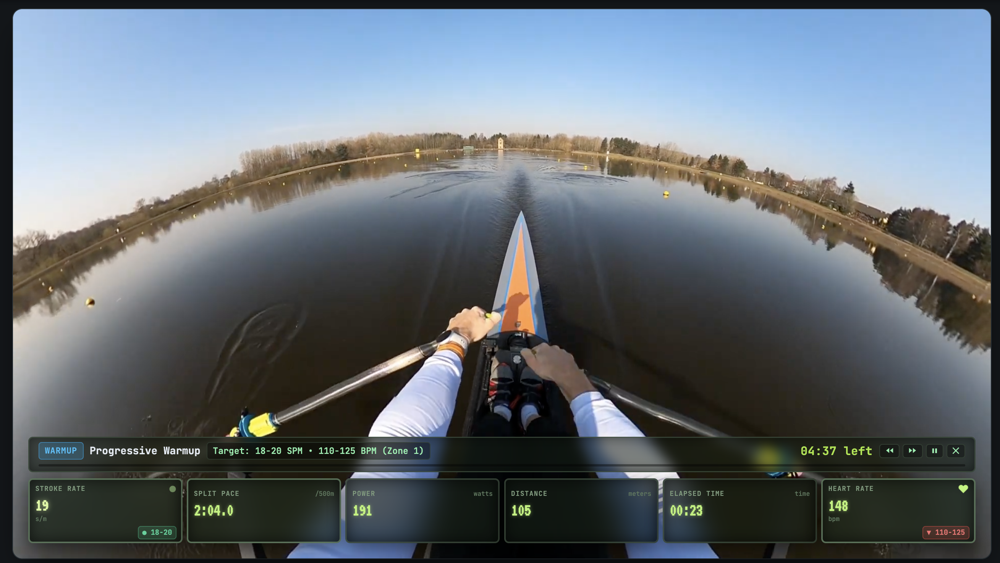

<p align="center">
  
</p>

<h1 align="center">FTMS-Rower</h1>

<p align="center">
  <strong>Scenic Indoor Rowing Dashboard & Telemetry HUD</strong><br>
  <em>Transform indoor rowing into an immersive outdoor experience for Concept2 and FTMS machines.</em>
</p>

<p align="center">
  
  
  
  
  
</p>

FTMS-Rower transforms indoor rowing into an immersive outdoor experience. As you row, your stroke cadence dynamically modulates video playback speed ($0.3\times \dots 2.5\times$), while soundtrack audio remains crystal-clear and locked at a steady $1.0\times$. Forked and reimagined from [manuelkamp/FTMS-rower](https://github.com/manuelkamp/FTMS-rower).

<p align="center">
  
  <em>Scenic Cockpit in Nordic Minimalist theme (translucent frosted glass) with real-time PM5 telemetry HUD, Lake Louise route, decoupled audio, and transport controls.</em>
</p>

---

## 📑 Table of Contents

- [Key Features](#-key-features)
- [Installation & Quick Start](#-installation--quick-start)
  - [Option 1: Docker Container (Recommended)](#option-1-docker-container-recommended)
  - [Option 2: Local Python Setup](#option-2-local-python-setup)
- [Network Access & Client Setup](#-network-access--client-setup)
  - [Step 1: Identify Server IP](#step-1-identify-server-ip)
  - [Step 2: Connect from Client Devices](#step-2-connect-from-client-devices)
  - [Step 3: Bluetooth on Client Devices](#step-3-bluetooth-on-client-devices)
- [Device & Browser Compatibility](#-device--browser-compatibility)
- [Running Automated Tests](#-running-automated-tests)
- [Known Issues & Troubleshooting](#-known-issues--troubleshooting)
- [Development Roadmap](#-development-roadmap)
- [Upstream Base & License](#-upstream-base--license)

---

## ✨ Key Features

### 1. 🎧 Decoupled Audio Pipeline & Cadence-Proportional Volume
- **Muted Scenic Video:** The video element is strictly muted so its playback rate can fluctuate dynamically ($0.3\times \dots 2.5\times$) without pitch distortion, chipmunking, or WebKit Phase Vocoder DSP overhead.
- **Fixed-Rate Soundtrack at 1.0×:** A decoupled HTML5 `<audio>` pipeline streams soundtracks at natural $1.0\times$ speed with pristine acoustic clarity.
- **Dynamic Cadence Volume Modulation:** Ambient soundtrack volume smoothly mirrors stroke cadence across an expanded ~14 dB dynamic range—dipping to an ambient **0.20×** floor during rests or glides, resting at a clean **0.70×** cruising baseline (20 SPM), and swelling up to **1.00×** (+3.1 dB) during high-cadence sprints without digital clipping.
  - *Automatic Activation:* Active by default on cadence-locked tracks; bypassed on Fixed 1.0× Ambient tracks.
  - *Adjustable Dynamics ($0.25\times \dots 2.50\times$):* Tune modulation intensity from subtle ($0.5\times$) to high-contrast swells ($2.0\times$) in Settings.
  - *Smooth Exponential Ramping:* Low-pass filter transitions volume smoothly to eliminate sudden jumps or clicks.
  - *Quick Toggles:* Toggle on/off instantly via the Cockpit Audio dropdown or Settings modal.
- **Dynamic Auto-Pause:** Pauses video playback when rowing halts while audio continues seamlessly (or auto-pauses based on user preference).
- **Autoplay Compliance:** Single-tap un-mute prompts satisfy modern browser media autoplay restrictions.

### 2. ⚡ Zero-Stutter Cadence Zones & Speed Modes
- **Hardware Stutter Elimination (iOS / iPadOS / Safari):** Quantizes playback into 4 discrete cadence tiers to prevent AVPlayer clock re-sync stalls during continuous cadence shifts:
  - **Recovery / Glide** (< 18 SPM): **0.85×**
  - **Base / Steady-State** (18 – 23 SPM): **1.00×** *(Native video speed — zero stutters for 90%+ of workout)*
  - **Tempo / Power** (24 – 27 SPM): **1.25×**
  - **Sprint / Max Effort** (28+ SPM): **1.50×**
- **3.0s Hysteresis Dwell Time:** Transitions require sustaining a new cadence zone for 3 seconds, preventing single-stroke flutter from resetting the presentation clock.
- **Cockpit Speed Mode Switcher:** Switch on the fly between:
  - **Cadence Zones (Smooth):** Zero-stutter zone playback with 3s hysteresis (default).
  - **Ambient (Fixed 1.0×):** Steady native speed that never accelerates, decelerates, or auto-pauses.
  - **Continuous Dynamic:** Proportional real-time rate scaling with 1.5s smoothing filter.

### 3. 📥 Dual Ingestion Engine (YouTube & Local Uploads)
- **YouTube Ingestion:** Downloads 1080p/4K H.264 video and extracts separate high-bitrate M4A audio via FastAPI, `yt-dlp`, and `ffmpeg`.
- **Direct File Upload:** Drag-and-drop or browse video (`.mp4`, `.mov`, `.webm`, `.mkv`) and audio (`.mp3`, `.m4a`, `.wav`, `.flac`) files with live chunked streaming upload progress and automatic thumbnail extraction.
- **Library Trimming & Scrubbing:** Preview media directly in the Media Center, adjust trim start/end timestamps with interactive scrubbers, and rename assets.
- **RFC 7233 Range Streaming:** Native HTTP 206 partial content streaming ensures instant scrubbing and seamless track looping.

<p align="center">
  
  <em>Media Center: YouTube ingestion, direct file upload, and track management with ambient and cadence modes.</em>
</p>

### 4. 🚣 Scenic "Tracks" & Cockpit Transport
- **Custom Track Segments:** Save curated segments within long videos with custom `start_time` and `end_time` (e.g., a 5K river loop).
- **Ambient vs. Cadence Modes:** Configure tracks to dynamically respond to cadence or lock at a steady 1.0× pace for relaxing scenery.
- **Curated Playlists & In-Modal Previews:** Associate default soundtracks and allowed playlists with an audition scrubber before saving.
- **Cockpit Transport Bar:**
  - **Restart (`⏮`):** Instantly jump to track start.
  - **Pan 10s (`⏪ 10s` / `⏩ 10s`):** Step backward or forward within track boundaries.
  - **Track Scrubber:** Responsive timeline slider bounded to active track limits.

### 5. 📊 PM5 Telemetry HUD & Visual Themes
- **Real-Time Glassmorphism Cockpit:**
  - **Pace / 500m:** Instantaneous split computed from power and stroke rate.
  - **Cadence (SPM):** Stroke rate with boat glide decay and 3.5s inactivity watchdog.
  - **Power (Watts):** Non-linear physics formula: $\text{Watts} = 2.80 / (P_{500}/500)^3$.
  - **Heart Rate (BPM):** BLE Heart Rate monitor integration with color-coded training zones.
  - **Distance & Time:** Distance rowed, elapsed time, and total stroke count.
  - **Resistance / Damper Badge (`RES Lvl X`):** Real-time resistance level from FTMS Bit 7 telemetry. *(Requires a rower with electronic resistance sensors; purely mechanical dials like Merach Q1 do not broadcast resistance).*
  - **Auto-Reset on Workout Start:** Starting a workout automatically establishes a baseline offset, zeroing Distance (`0m`) and Elapsed Time (`00:00`).
  - **Click-to-Zero Metrics:** Click or tap Distance or Elapsed Time at any time to reset counters with confirmation.
- **Screen Wake Lock API:** Automatically keeps mobile and desktop displays awake (`navigator.wakeLock`) during active workouts.
- **Auto-Hide UI:** Cockpit controls smoothly fade out after 4 seconds of inactivity for a cinematic fullscreen view.
- **Multiple Visual Themes:**
  - **Modern Slate (Default):** High-contrast dark charcoal glass cockpit with sky-blue accents.
  - **Nordic Minimalist:** Elegant translucent frosted white/glass aesthetic with soft gold and ice tones.
  - **Neon Cyberpunk:** OLED dark glass with laser cyan and magenta synthwave glow.
  - **Concept2 PM5 LCD:** Matte bezel with authentic phosphorescent green LCD styling.

<p align="center">
  
  
</p>
<p align="center">
  <em>Left: Neon Cyberpunk theme on ambient route. Right: Modern Slate (default dark theme) during a high-cadence sprint.</em>
</p>

### 6. ⏱️ Structured Training Programs & Real-Time Interval Pacing
- **Curated Program Library:** Preloaded routines designed for diverse training goals:
  - *Endurance & Aerobic Base:* 30-Minute Zone 2 Aerobic Base, 4 × 1000m Aerobic Threshold, 5K Negative Split & Rate Ladder.
  - *Intervals & HIIT:* 5 × 500m Power Intervals, Tabata Rowing Sprints (8 cycles of 20s work / 10s rest).
  - *Pyramids:* Sprint Distance Pyramid (250m $\to$ 500m $\to$ 750m $\to$ 500m $\to$ 250m).
- **Human-Readable YAML Schema:** Easily create, modify, import, and export structured routines in YAML (`.yaml` / `.yml`) or JSON with time-based (`duration: "5m"`), distance-based (`distance: 1000`), or stroke-based (`strokes: 30`) triggers and repeat loops (see [YAML Schema Guide](docs/WORKOUT_SCHEMA.md)).
- **Docked Workout Interval Ribbon:** Sleek translucent HUD bar anchored directly above the PM5 metrics grid displaying:
  - Interval type badges (`WARMUP`, `WORK`, `REST`, `COOLDOWN`) and step titles.
  - Real-time remaining countdown timer (`MM:SS left` or meters left).
  - High-performance GPU-composited progress fill bar (`scaleX`).
  - Interval controls: Skip backward (`⏮`), skip forward (`⏭`), pause/resume (`⏸` / `▶`), and exit (`✕`).
- **Live Target Compliance Chips:** Real-time visual feedback badges embedded directly in PM5 metric cards:
  - `● [target]` — In target zone (steady green dot).
  - `▲ [target]` — Under target; stroke rate, power, or pace increase needed.
  - `▼ [target]` — Over target; ease off pace to stay in specified recovery or target zone.
  - `⏸ ▲ [target]` — Indicates paused state compliance.
- **Synthesized Audio Coaching Cues & Beeps:** Web Audio 3-2-1 transition countdown beeps and interval completion chimes guide transitions without requiring visual attention on the screen. Floating coaching cue banners deliver technique reminders at interval start or midpoint.
- **Adaptive HUD Density:** When HUD scale is set to Auto/Adaptive, the telemetry grid automatically condenses into compact density when the workout ribbon is visible, preserving maximum scenic video viewport space.
- **Session Pause Isolation & Countdown Auto-Zero:**
  - 5-second countdown lead-in automatically zeros Distance (`0m`) and Elapsed Time (`00:00`) at the exact start of Interval 1.
  - Pausing a program holds distance and elapsed time with an amber `PAUSED` badge while live stroke telemetry continues to stream. Paused strokes and meters are strictly isolated and excluded from session summary averages.

<p align="center">
  
</p>
<p align="center">
  <em>Training Programs Library: Built-in routines, category filter chips (Endurance, Intervals, Pyramids, Custom), step timelines, and YAML import/export.</em>
</p>

<p align="center">
  
</p>
<p align="center">
  <em>Cockpit HUD during an active structured workout: Docked interval ribbon with step countdown, GPU-composited progress bar, real-time target compliance chips (SPM and HR), and Concept2 PM5 theme.</em>
</p>

### 7. 🔌 Dual-Source Telemetry & Virtual Simulator
- **Web Bluetooth FTMS:** Direct connection to FTMS rowers (`0x2AD1`) including Merach Q1S, Concept2 PM5, WaterRower ComModule, and standard BLE Heart Rate monitors (`0x180D`).
- **Dynamic Workout Simulator:** Built-in simulator featuring:
  - **Dynamic Program:** Automatically cycles through Warmup, Surge, Sprint, Paddle Down, Rest (testing auto-pause), and Recovery.
  - **Structured Program Following:** Automatically drives stroke rate, watts, and recovery phases matching the active workout program.
  - **Decoupled HR Monitor:** Independent Polar H10 Heart Rate simulation loop with manual BPM slider.
  - **Manual Slider:** Fine-tune target SPM ($14 \dots 38$) with live split and watt calculations.
  - **Instant Pause / Resume:** Test boat glide decay and auto-pause behavior instantly.

### 8. 💾 Session History & Multi-Lap TCX Export (Garmin & Strava)
- **Local Persistence:** Workouts and per-second trackpoint telemetry are stored locally in SQLite (`data/sessions.db`).
- **Interval-by-Interval Lap Breakdown:** Structured program sessions record discrete `<Lap>` blocks with `Active`/`Resting` intensity classifications, average watts (`<LX><AvgWatts>`), cadence, and heart rate for automatic interval breakdown in Garmin Connect and Strava Workout Analysis.
- **Batch Export & Management:** Export workouts individually or in bulk (`.zip`) to standard **Garmin Training Center XML (`.TCX`)** format, with multi-session selection and batch deletion.

---

## 🚀 Installation & Quick Start

### Prerequisites
- Python 3.10+ (if running bare-metal)
- `ffmpeg` installed on your host system (`brew install ffmpeg` on macOS or `sudo apt install ffmpeg` on Ubuntu)
- Google Chrome, Microsoft Edge, or any Chromium browser supporting Web Bluetooth (or any browser via Relay Bridge)

---

### Option 1: Docker Container (Recommended)

Following the standard LinuxServer container pattern, persistent database files (`sessions.db`) and media are mapped to `./config`:

```bash
# 1. Clone the repository
git clone https://github.com/mosswild/FTMS-YT-Rower.git
cd FTMS-YT-Rower

# 2. Build and launch container
docker compose up -d
```

Open `http://localhost:8000` in your browser.

#### Customizing the Port:
- **Via `.env` file:** Copy `.env.example` to `.env` and set `PORT=9000`.
- **Via command line:**
  ```bash
  PORT=9000 docker compose up -d
  ```

#### Container Details (`docker-compose.yml`):
- **Port Mapping:** `${PORT:-8000}:${PORT:-8000}`
- **Container Name:** `ftms-rower`
- **Volume:** `./config:/config` (persists SQLite database under `/config/data` and media under `/config/media`)
- **User Permissions:** Supports `PUID` and `PGID` environment variables (default: `1000:1000`) for seamless non-root host file ownership.

> 📖 **Helpful Guides:**
> - [Structured Workout YAML Schema Guide](docs/WORKOUT_SCHEMA.md) (specification, examples, and compliance rules)
> - [Synology NAS Docker Setup Guide](docs/DOCKER_SYNOLOGY.md) (step-by-step GUI instructions for Synology Container Manager)
> - [Bluetooth Relay Bridge Setup Guide](docs/BLUETOOTH_RELAY.md) (auto-start on Windows boot, macOS launchd, and Linux systemd)

---

### Option 2: Local Python Setup

```bash
# 1. Clone the repository
git clone https://github.com/mosswild/FTMS-YT-Rower.git
cd FTMS-YT-Rower

# 2. Create and activate virtual environment
python3 -m venv .venv
source .venv/bin/activate  # On Windows: .venv\Scripts\activate

# 3. Install dependencies
pip install -r requirements.txt

# 4. Start the FastAPI server
uvicorn backend.main:app --host 0.0.0.0 --port 8000
```

Open `http://localhost:8000` in your browser.

---

## 📱 Network Access & Client Setup

Once FTMS-Rower is running on your host machine or NAS, you can access it from any tablet, phone, laptop, or smart TV on your local network.

### Step 1: Identify Server IP
Find the local network IP of your host server:
- **macOS / Linux:** Run `ifconfig` or `ip a` (look for `inet` under your active adapter, e.g. `192.168.1.45`).
- **Windows:** Run `ipconfig` in Command Prompt (look for `IPv4 Address`).

### Step 2: Connect from Client Devices
Open Google Chrome, Microsoft Edge, or Safari on your client device and browse to:
```text
http://<YOUR-SERVER-IP>:8000
```
*(Or `http://<YOUR-SERVER-IP>:8000/ftms-rower`)*

> [!TIP]
> **Install as a Home Screen App (PWA):**
> - **iOS / iPadOS:** Tap the **Share** button in Safari and select **"Add to Home Screen"**.
> - **Android (Chrome):** Tap the **Menu** (three dots) and select **"Add to Home Screen"** or **"Install App"**.
> 
> This provides an app-like, fullscreen cockpit view with safe-area notch support.

### Step 3: Bluetooth on Client Devices

Modern browsers enforce strict security on Web Bluetooth (`navigator.bluetooth`). Choose the setup that matches your devices:

#### A. iPhone & iPad (iOS Safari) — Recommended: Wi-Fi Relay Bridge
Apple blocks Web Bluetooth in iOS Safari. The zero-hassle way to connect iOS devices is using the **Wi-Fi Bluetooth Relay Bridge**:
- **On Windows Host (Running Docker or Python):**  
  Double-click `run_relay_windows.bat` in the repository root. It checks dependencies, connects to your rower using native Bluetooth, and streams telemetry directly to your server.
- **On macOS / Linux Host:**
  ```bash
  pip install bleak
  python scripts/bluetooth_relay.py --server http://localhost:8000
  ```
- **Inside Docker (Linux with D-Bus):**  
  Set `ENABLE_BLUETOOTH_RELAY=true` and mount `/var/run/dbus` in [docker-compose.yml](docker-compose.yml).

Once running, open standard iOS Safari at `http://<SERVER-IP>:8000`. Telemetry connects automatically over WebSockets with zero third-party apps, landscape broadcast support, and AirPlay mirroring!

> 📖 **Zero-Click Auto-Start:** See the [Bluetooth Relay Bridge Setup Guide](docs/BLUETOOTH_RELAY.md) for Windows auto-start (`shell:startup`), macOS `launchd`, and Linux `systemd` service configurations.

#### B. Android Tablets & Phones (Direct Web Bluetooth)
- Open Google Chrome on your Android device.
- Navigate to `chrome://flags/#unsafely-treat-insecure-origin-as-secure`.
- Add `http://<YOUR-SERVER-IP>:8000` (and `http://<YOUR-SERVER-IP>:8000/ftms-rower`), select **Enabled**, and restart Chrome.
- Tap **"Add to Home screen"** or **"Install app"** for a fullscreen standalone app with native Web Bluetooth!

#### C. Reverse Proxy with HTTPS (Universal)
- Place FTMS-Rower behind a reverse proxy with a local SSL certificate (e.g., Nginx, Caddy, Traefik, or Synology Reverse Proxy).
- Secure HTTPS origins automatically unlock Web Bluetooth across all Chromium browsers without flag toggling. See the [Synology NAS Docker Guide](docs/DOCKER_SYNOLOGY.md#option-1-synology-reverse-proxy-with-https-recommended).

---

## 🌐 Device & Browser Compatibility

FTMS-Rower supports both **Direct Web Bluetooth** and **Wi-Fi WebSocket Relay** modes, allowing it to run on virtually any modern device.

| Platform / Browser | Direct Web Bluetooth | Wi-Fi Relay Bridge | Virtual Simulator | Notes |
|:---|:---:|:---:|:---:|:---|
| **Google Chrome** (macOS, Windows, Linux, Android) | ✅ Yes | ✅ Yes | ✅ Yes | Native Web Bluetooth supported out-of-the-box. |
| **Microsoft Edge** (Windows, macOS, Android) | ✅ Yes | ✅ Yes | ✅ Yes | Native Web Bluetooth supported out-of-the-box. |
| **Brave / Opera** (Desktop & Android) | ✅ Yes | ✅ Yes | ✅ Yes | Native Web Bluetooth supported out-of-the-box. |
| **Apple Safari** (iOS, iPadOS, macOS) | ⚠️ Via Relay | ✅ Yes | ✅ Yes | Apple disables Web Bluetooth; connects via Wi-Fi Relay Bridge with PWA and AirPlay support. |
| **Mozilla Firefox** (Desktop & Android) | ⚠️ Via Relay | ✅ Yes | ✅ Yes | Connects seamlessly via Wi-Fi Relay Bridge. |
| **Smart TV Browsers & Apple TV** | ⚠️ Via Relay / AirPlay | ✅ Yes | ✅ Yes | Stream metrics over Wi-Fi, or mirror via AirPlay in landscape broadcast mode. |

### Bluetooth Connection Modes

1. **Direct Web Bluetooth:**
   - Pairs directly between your browser and rowing machine / HR monitor over Bluetooth Low Energy (`navigator.bluetooth`).
   - Requires a Chromium browser (Chrome, Edge, Opera, Brave).
   - Works immediately on `localhost` and `127.0.0.1`. For remote LAN IPs, enable the Chrome insecure-origin flag or use an HTTPS reverse proxy.

2. **Wi-Fi WebSocket Relay Bridge:**
   - Host machine pairs to the rower via `bleak` ([scripts/bluetooth_relay.py](scripts/bluetooth_relay.py) or `run_relay_windows.bat`) and broadcasts telemetry over WebSockets.
   - **Real-Time Live Console HUD:** Single-line terminal dashboard showing composite metrics (`[09:35:14 PM] [MRK-CRYDN-2CEE] 24 SPM | 145W | 2:12/500m | 1,240m | 05:42`) with automatic packet merging and live timestamps.
   - **Battery Conservation Sleep:** Automatically disconnects after 5 minutes of inactivity (`--idle-timeout 300`) and enters a 6-minute radio silence window (`--silence-window 360`). Zero scan packets are sent, allowing rower hardware (e.g. Merach Q1) to power down its console and LCD screen. Pressing `[r]`, space, or Enter exits the mute stage early and resumes connection search, while `[q]`, `[x]`, or `Ctrl+C` immediately terminates the relay.
   - **Zero Browser Restrictions:** All devices (Safari, Firefox, Smart TVs) connect over plain HTTP without browser flags or certificates.

---

## 🧪 Running Automated Tests

Execute the backend test suite to verify physics calculations, session persistence, TCX generation, and streaming:

```bash
PYTHONPATH=. .venv/bin/python tests/test_backend.py
```

### Test Coverage:
- Concept2 pace-to-watts physics formulas
- SQLite session CRUD and database migrations
- Garmin TCX XML trackpoint generation and schema compliance
- RFC 7233 HTTP 206 partial content streaming
- FastAPI REST endpoints
- Scenic track configuration, filtering, and retrieval
- Multipart synthetic video and audio file uploads

---

## 🐛 Known Issues & Troubleshooting

- [x] **Scenic Video Autoplay on Relay Connect:** Resolved. Strictly gated video and soundtrack playback behind live workout status (`isWorkoutLive`). When the app opens and the rower connects via the Bluetooth relay or BLE, telemetry streams to the HUD while the scenic video remains paused until "Start Workout" is activated or the staged program is pulled to start.
- [x] **iOS Safari & Standalone WebApp (PWA) Screen Sleep During Workouts:** Resolved. Implemented a dual-tier keep-awake engine combining W3C `navigator.wakeLock` (with automatic re-acquisition) and an invisible inline NoSleep MP4 loop with silent AAC audio pre-armed on user touch. Because iOS WebKit ignores muted video for sleep prevention, this active media assertion ensures Apple's AVPlayer suppresses display sleep throughout live workouts.
- [x] **Scenic Video Freeze on Initial Workout Launch (iOS Safari / WebKit):** Resolved. Added buffer readiness checks (`readyState >= 2`), a pending playback rate queue, and an internal WebKit stall recovery watchdog in `RateController` that soft-recovers decoder stalls if `video.currentTime` fails to advance after 1.5s of telemetry.
- [x] **Compact Mode Minimal Pause Indicator:** Resolved. Refined `.hud-scale-compact` and mobile styles to replace wide text pills with a sleek, non-intrusive `⏸` icon badge and scaled center alert that prevents clutter in narrow cell layouts.
- [x] **Compact & Mobile Pause Indicator Badge:** Resolved. Replaced wide text labels inside metric cards on smaller resolutions, mobile landscape (`max-height: 520px`), and compact views with a sleek, non-intrusive minimal `⏸` icon badge that fits seamlessly without crowding readouts.
- [x] **FTMS Stroke Rate (SPM) Calibration & Multiplier:** Resolved. Eliminated the flawed `rawSpm > 50` threshold heuristic in `js/modules/ble-rower.js` and `scripts/bluetooth_relay.py`. Standardized decoding to the Bluetooth SIG FTMS v1.0 specification (0.5 stroke/minute units), and introduced hardware cadence calibration (`0.5×` standard, `0.25×` quarter-scale for machines broadcasting doubled flywheel pulses/half-strokes, and `1.0×` direct). Configurable via terminal hotkey `[s]`, `--spm-multiplier`, or the web app Settings modal with persistent `localStorage`.
- [x] **Base SPM Parameterization Across Workout Programs & Simulator:** Resolved. Connected the Settings **Baseline SPM** slider to `WorkoutEngine`, `VirtualRowerSimulator`, and persistent `localStorage` (`ftms_baseline_spm`). When an athlete configures a custom Base SPM (e.g. 24 SPM instead of nominal 20 SPM), all structured workout intervals and simulator phases dynamically scale their target SPM ranges by `baseSpm - 20` in real time while preserving 0 SPM rest periods.

---

## 🗺️ Development Roadmap

### Upcoming
- [x] **Structured & Built-In Programs:** Configurable interval workout programs specifying rest periods, baseline rowing periods, and high-intensity sprint segments. Features live Cockpit HUD segment tracking with countdown timers, target SPM / Heart Rate zones, and visual target feedback. Import/export support for JSON and YAML formats (see [YAML Schema Guide](docs/WORKOUT_SCHEMA.md)).
  - [x] The last fix to stop the workout when switching workouts worked.
  - [x] Adopted "Programs" for the planned structured routines, "Intervals" for segment steps, and "Sessions" for recorded history. Renamed "Workouts" tab to "Programs" and Cockpit dropdown to "Programs ▾".
  - [x] When the workout bar is visible, HUD density automatically switches to compact mode when Auto/Adaptive is set, and cleanly reverts back when the workout bar is hidden or the program ends.
  - [x] **Cyberpunk Theme Fix:** Standardized Cyberpunk metric cell padding, font line-height, and ECG waveform height so metric cell dimensions match the other three themes.
  - [x] **Workout Bar Theme:** Increased workout bar transparency on Modern Slate, Cyberpunk, and Retro Concept2 PM5 themes so scenic video remains visible behind the interval ribbon.
  - [x] **Target Indicators for Workout:** Positioned target compliance chips at a consistent bottom offset across all metric cells for a unified horizontal baseline.
  - [x] **Program Session Tracking & Paused Metrics:** When a program is paused, live pulling metrics (SPM, Watts, Split, HR) continue to stream and update in real time while Elapsed Time and Distance hold frozen with an amber `PAUSED` indicator badge.
  - [x] Distance and elapsed time should be set to zero after the 5 second countdown leading up to the first interval of the program. Right now it just aggregates distance and elapsed time during this countdown. 
  - [x] Ensure that any SPM/Watts/Split/HR data that is tracked during a Program pause period isn't aggregated into the session average metrics.
  - [x] **Interval-by-Interval Export (Garmin & Strava):** Record structured program interval transitions as discrete lap markers in session history and export files (`.tcx` / `.fit`) to enable automatic interval and work/rest breakdown in Garmin Connect and Strava Workout Analysis.
- [x] **Simulator Fixes:**
  - [x] Hitting "Stop Simulator" now immediately zeroes out live metric displays (SPM, Split, Watts).
  - [x] Decoupled simulated Polar H10 Heart Rate monitor from the virtual rowing machine with an independent simulation loop so both can be enabled or disabled on their own.
- [x] **Theme Fixes for Small Resolutions:** 
  - [x] Fixed Nordic Minimalist and Cyberpunk cell transparency so all 6 metric cards remain uniformly translucent on mobile and small screens.
  - [x] Responsive navigation bar padding and font scaling across all themes prevents the header from overflowing or running past the screen edge on narrow viewports.
  - [x] Scaled target compliance chips and badges in the 2x3 mobile grid to guarantee they fit within metric cells without obscuring numeric readouts.
- [x] **Cadence Audio Volume Modulation Dynamic Range Fix:** Rebalanced the volume modulation curve in `AudioEngine` so dynamic swells and dips are clearly audible across the full rowing spectrum. Centered nominal baseline (20 SPM) at 70% scale, allowing sprints (30–38 SPM) to swell up to 100% (+3.1 dB), recovery paddling (14 SPM) to dip down to ~44% (-4.0 dB), and resting / stopped (0 SPM) to drop down to a quiet 20% ambient floor (-10.9 dB), expanding perceptible dynamic range from ~1.2 dB up to ~14 dB without digital clipping.
- [x] **Dual-Device BLE Relay (Concurrent Rower + Heart Rate Monitor):**
  - **Problem Statement:** Most commercial smart rowing machines (such as the Merach Q1S, MRK-2CEE, or Concept2 without an external ANT+ bridge) broadcast FTMS rower telemetry (`0x1826` / `0x2AD1`) but do not broadcast heart rate data. Devices lacking Web Bluetooth (e.g. iOS Safari over local Wi-Fi) rely on the Python bridge (`scripts/bluetooth_relay.py`), which previously only maintained a single `BleakClient` connection to the rower.
  - **Architecture & Implementation:**
    - **Concurrent Connection Loops:** Manages two independent, concurrent asyncio tasks via `asyncio.gather()` for Rower (`0x1826` / `0x2AD1`) and Heart Rate monitors (`0x180D` / `0x2A37`).
    - **Device Memory & Auto-Reconnect:** Remembers paired devices in `~/.ftms_relay_devices.json` and automatically reconnects on subsequent launches without needing CLI flags.
    - **Interactive Terminal Controls:** Press `[r]` to scan/select rower, `[h]` to scan/select HR monitor, `[d]` to disconnect, `[c]` to clear memory, and `[m]` for help directly in the terminal without restarting the relay bridge.
    - **CLI Interface:** Added `--hr` (auto-pair first discovered BLE HR strap), `--hr-name <str>`, `--hr-address <addr>`, `--forget`, and `--no-interactive` flags.
    - **Telemetry Fusion:** Merges FTMS rowing telemetry with real-time cardiac data (`parse_hr_measurement()`) into unified composite packets broadcast over HTTP/WebSocket (`/api/telemetry/publish`).
    - **Console HUD Readout:** Single-line real-time status bar simultaneously displaying Rower and HR monitor connection state and metrics (e.g., `[MRK-2CEE | Polar H10] 24 SPM | 185W | 2:05/500m | 142bpm | 1,240m | 05:42`).
    - **Web App Decoupling:** Decoupled `js/app.js` and `js/modules/ws-telemetry.js` so relay-delivered HR packets update the PM5 HUD and session metrics even if a user connects their rower directly via browser Web Bluetooth or simulator.
- [ ] **Live GitHub Pages Demo:** Client-side demo on GitHub Pages for previewing the scenic cockpit HUD, visual themes, telemetry charts, and simulator directly in the browser with bundled lightweight sample media.

### Recent Milestones
- [x] **Dual-Device BLE Relay & Interactive Terminal Bridge:** Concurrent asyncio Bluetooth connection loops for FTMS rowers and BLE Heart Rate straps (Polar, Garmin, Wahoo, Apple Watch), device memory with auto-reconnect, interactive terminal controls (`[r]` rower, `[h]` HR, `[d]` disconnect), collision-free scan coordination, and decoupled browser mixed-mode support.
- [x] **Bluetooth Relay Live Terminal HUD & Battery Conservation:** Single-line console dashboard with automatic packet merging and customizable radio silence sleep window (`--silence-window`) to allow rowers to power down.
- [x] **Auto-Reset & Click-to-Zero Metrics:** Auto-zeroes session distance and elapsed time on workout start, plus on-demand tap-to-zero with confirmation.
- [x] **Live Damper / Resistance Level (FTMS Bit 7):** Telemetry extraction and cockpit badge display for compatible electronic-resistance rowers.
- [x] **Screen Wake Lock API:** Keeps mobile and desktop displays awake (`navigator.wakeLock`) during active workouts and videos.
- [x] **Cadence-Proportional Audio Volume:** Dynamic volume modulation with exponential ramping, adjustable rate factor, and audio dropdown toggles.
- [x] **Cockpit Speed Modes & Zero-Stutter Zones:** In-cockpit speed selector for Cadence Zones (0.85× / 1.0× / 1.25× / 1.5× with 3s hysteresis), Fixed 1.0× Ambient, and Continuous Dynamic.
- [x] **WebKit & iOS Playback Optimizations:** Quantized rate deadband, Phase Vocoder bypass, 1 MB streaming chunks, and 1080p resolution caps.
- [x] **Mobile & Standalone PWA Polishing:** Responsive layout for iPhone and compact devices, landscape broadcast HUD, and custom PWA app icon suite.
- [x] **Batch Workout Management:** Multi-select session history with batch deletion and bulk export as `.zip` archive of `.tcx` files.
- [x] **Media Center & Track Builder:** Direct drag-and-drop file upload, custom track segmentation, in-library preview scrubbers, and track-filtered cockpit selectors.

---

## 📄 Upstream Base & License

Original proof-of-concept created by [Manuel Kamp](https://github.com/manuelkamp/FTMS-rower).  
Modernized and expanded with decoupled audio, YouTube ingestion, PM5 HUD, Scenic Tracks, and session persistence.

Released under the [MIT License](LICENSE).