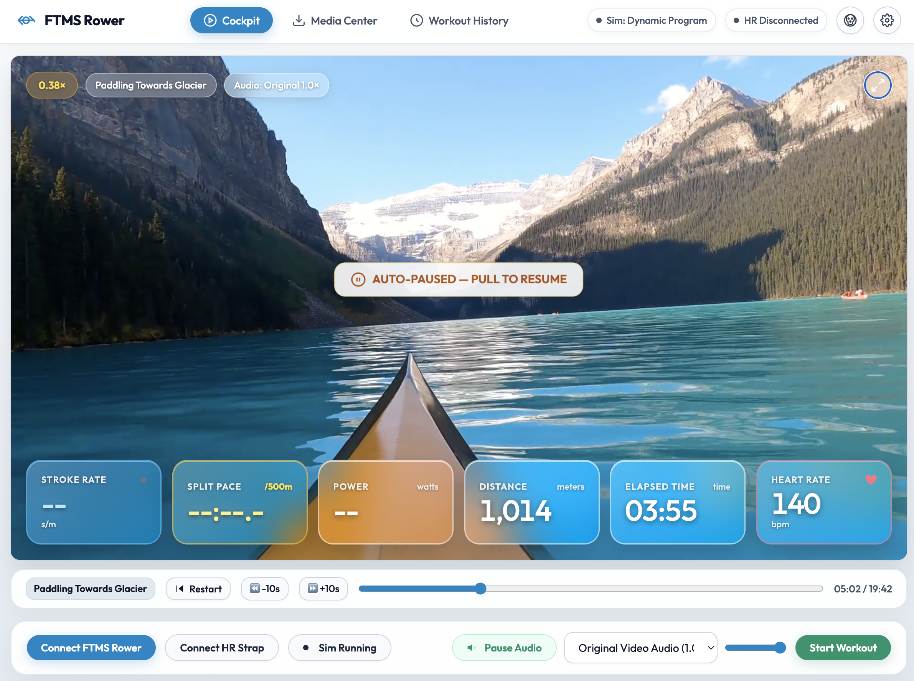
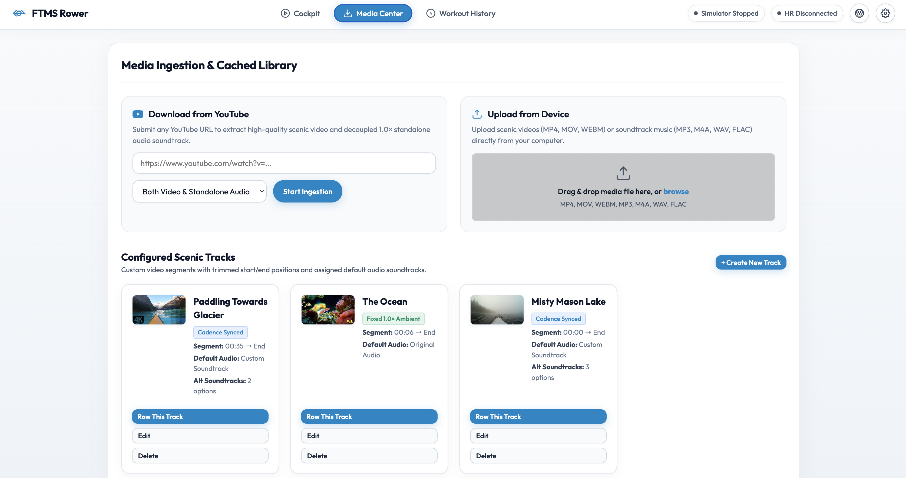
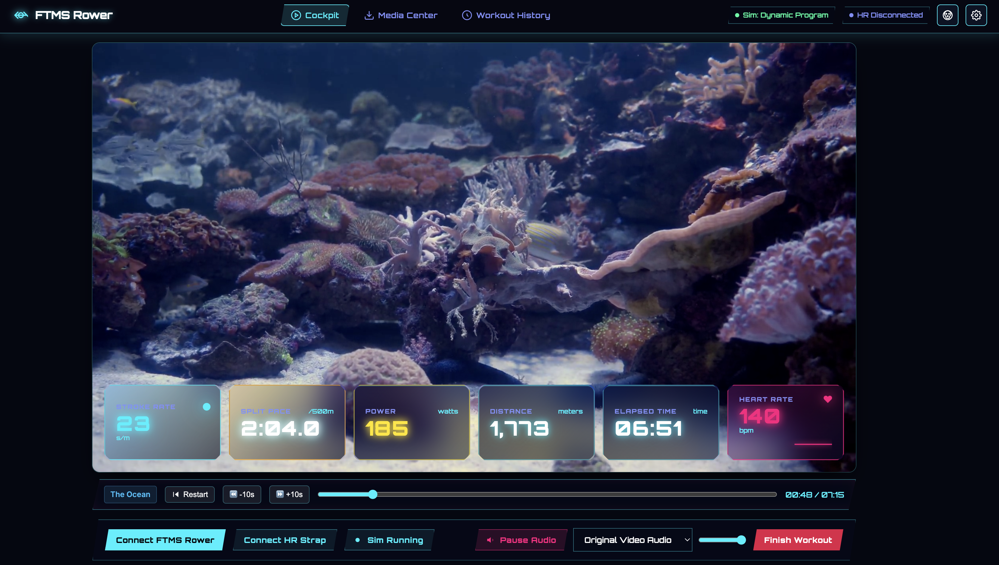
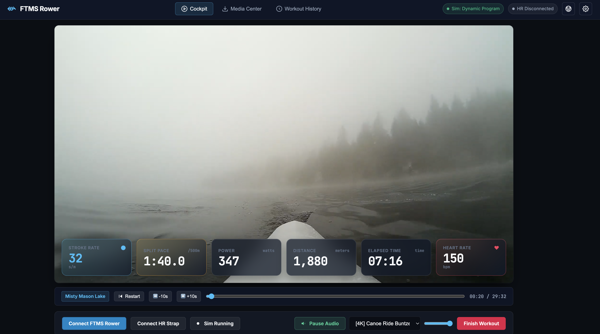

# FTMS-Rower: Scenic Indoor Rowing Dashboard & Telemetry HUD

A modernized, full-stack scenic indoor rowing application and simulator for Bluetooth FTMS rowing machines. Forked and reimagined from [manuelkamp/FTMS-rower](https://github.com/manuelkamp/FTMS-rower).

FTMS-Rower transforms indoor rowing into an immersive outdoor experience. As you row, your stroke cadence dynamically modulates video playback speed ($0.3\times \dots 2.5\times$), while soundtrack audio remains crystal-clear and locked at a steady $1.0\times$.

<p align="center">
  
  <em>Scenic Cockpit in Nordic Minimalist theme (translucent frosted white/glass) with real-time PM5 telemetry HUD, Lake Louise route, decoupled audio, and transport controls.</em>
</p>

---

## Key Features

### 1. Decoupled Audio Pipeline
- **Muted Scenic Video:** The scenic video element is strictly muted so its playback rate can fluctuate freely between $0.3\times$ (paddle) and $2.5\times$ (all-out sprint) without audio pitch distortion or chipmunk effects.
- **Fixed-Rate Soundtrack:** A decoupled HTML5 `<audio>` element streams the extracted soundtrack or custom playlist at native $1.0\times$ speed.
- **Dynamic Auto-Pause:** When rowing halts or pauses on cadence-synced tracks, the video pauses while the audio soundtrack continues smoothly (or pauses if configured in Settings).
- **Autoplay Handling:** Includes one-click un-mute prompt complying with modern browser autoplay policies.

### 2. Dual Ingestion Engine (YouTube & Local Device Upload)
- **YouTube Ingestion:** Ingests 1080p/4K H.264 video and extracts separate high-quality M4A audio tracks via FastAPI, `yt-dlp`, and `ffmpeg`.
- **Direct Device Media Upload:** Drag-and-drop or browse videos (`.mp4`, `.mov`, `.webm`, `.mkv`) and soundtrack audio (`.mp3`, `.m4a`, `.wav`, `.flac`) directly from your computer with live chunked streaming upload progress and automatic poster thumbnail extraction.
- **In-Library Trimming & Previews:** Preview any video or soundtrack in the Media Center, adjust trim start/end points with interactive scrubbers, and rename media assets.
- **RFC 7233 Range Streaming:** Supports HTTP 206 partial content streaming for instant, smooth video scrubbing and track looping.

<p align="center">
  
  <em>Media Center: YouTube ingestion, direct device file upload, and configured scenic tracks with cadence-synced and ambient modes.</em>
</p>

### 3. Scenic "Tracks" Feature & Cockpit Transport
- **Custom Track Segments:** Define and save segments within videos with specified `start_time` and `end_time` (e.g., a pristine 5K river loop).
- **Ambient vs. Cadence Modes:** Configure tracks to dynamically sync video speed with your rowing cadence, or lock to a steady **Fixed 1.0× Ambient** speed for relaxing scenery that never speeds up, slows down, or auto-pauses during intervals.
- **Loop Boundary Enforcement:** Videos loop smoothly within the track's configured start and end timestamps.
- **Audio Association & Live Preview Player:** Assign default audio soundtracks and curate allowed playlists with an in-modal audio preview player and timeline scrubber to audition tracks before saving.
- **Edit Existing Tracks & Video Thumbnails:** Edit any existing track at any time with live video thumbnail previews displaying duration and file sizes.
- **Cockpit Transport Bar:**
  - **Restart Track (`⏮`):** Immediately jumps back to the track's start position.
  - **Pan Back 10s (`⏪ 10s`):** Steps backward within the track bounds.
  - **Pan Forward 10s (`⏩ 10s`):** Steps forward within the track bounds.
  - **Track Scrubber:** Responsive timeline slider bounded specifically to the active track duration.

### 4. Concept2 PM5-Style Telemetry HUD & Visual Themes
- **Real-time Glassmorphism Cockpit:**
  - **Pace / 500m:** Instantaneous pace computed from power/stroke rate.
  - **Cadence (SPM):** Stroke rate with boat glide deceleration and 3.5s inactivity auto-pause watchdog.
  - **Power (Watts):** Concept2 non-linear formula: $\text{Watts} = 2.80 / (P_{500}/500)^3$.
  - **Heart Rate (BPM):** BLE Heart Rate monitor integration with color-coded training zones.
  - **Distance & Time:** Distance rowed, elapsed time, and total stroke count.
- **Auto-Hide:** Automatically fades out controls after 4 seconds of inactivity for a cinematic fullscreen view.
- **Multiple Visual Themes:** Switch themes on the fly from the Settings modal:
  - **Modern Slate (Default):** High-contrast dark charcoal glass cockpit with clean sky-blue telemetry accents.
  - **Nordic Minimalist:** Elegant translucent frosted white/glass aesthetic with soft sunrise gold and ice tones.
  - **Neon Cyberpunk:** OLED dark glass with laser cyan and magenta synthwave glow for high-energy sessions.
  - **Concept2 PM5 LCD:** Authentic matte bezel with phosphorescent green digital LCD monitor styling.

<p align="center">
  
  
</p>
<p align="center">
  <em>Left: Neon Cyberpunk theme on ambient underwater coral route. Right: Modern Slate (default dark theme) during a high-cadence lake sprint.</em>
</p>

### 5. Dual-Source Telemetry & Virtual Simulator
- **Web Bluetooth FTMS:** Connects to standard FTMS rowing machines (`0x2AD1`) including Merach Q1S, Concept2 PM5, WaterRower ComModule, and standard BLE Heart Rate monitors (`0x180D`).
- **Dynamic Workout Simulator:** Built-in rowing simulator with two operating modes:
  - **Dynamic Program:** Automatically cycles through structured interval training phases:
    1. *Warmup / Cruise* (22 SPM, 2:05 split)
    2. *Surge Phase* (29 SPM, 1:48 split)
    3. *Sprint All-Out* (34 SPM, 1:35 split)
    4. *Paddle Down* (17 SPM, 2:18 split)
    5. *Rest & Auto-Pause* (0 SPM — tests auto-pause watchdog)
    6. *Catch & Recover* (25 SPM, 1:58 split)
  - **Manual Slider:** Fine-tune target SPM ($14 \dots 38$) with live split and watt calculations.
  - **Instant Pause / Resume:** "Pause Pulling" button to immediately halt stroke production and test boat glide and auto-pause.

### 6. Session Persistence & Garmin TCX Export
- Workouts and per-second trackpoint telemetry are stored locally in SQLite (`data/sessions.db`).
- Export complete workout history to standard **Garmin Training Center XML (`.TCX`)** format compatible with Strava, Garmin Connect, and TrainingPeaks.

---

## Installation & Quick Start

### Prerequisites
- Python 3.10+
- `ffmpeg` installed on your system (`brew install ffmpeg` on macOS or `sudo apt install ffmpeg` on Ubuntu)
- Google Chrome, Microsoft Edge, or any Chromium browser supporting Web Bluetooth

### Option A: Docker Container Deployment (Recommended)
Following the standard LinuxServer/self-hosting container pattern, persistent database (`sessions.db`) and downloaded media are mapped to `./config`:

```bash
# 1. Clone the repository
git clone https://github.com/mosswild/FTMS-YT-Rower.git
cd FTMS-YT-Rower

# 2. Build and launch container
docker compose up -d
```

Open `http://localhost:8000` in Google Chrome or Edge.

#### Customizing the Port:
To run on a different port (e.g. `9000`):
- **Via `.env` file:** Copy `.env.example` to `.env` and set `PORT=9000`.
- **Or via command line:**
  ```bash
  PORT=9000 docker compose up -d
  ```
  The app will immediately bind to `http://localhost:9000`.

#### Container Configuration (`docker-compose.yml`):
- **Port:** `${PORT:-8000}:${PORT:-8000}`
- **Container Name:** `ftms-rower`
- **Volume:** `./config:/config` (persists SQLite database under `/config/data` and scenic videos/audio under `/config/media`)
- **User Permissions:** Supports `PUID` and `PGID` environment variables (default: `1000:1000`) for seamless non-root host file ownership.

> 📖 **Synology NAS Setup Guide:** For step-by-step GUI instructions using **Synology Container Manager**, check out the [Synology NAS Docker Setup Guide](docs/DOCKER_SYNOLOGY.md).

---

## 📱 Accessing Across Your Home Network (NAS / Docker)

Once the server or container is running on your host machine or NAS, you can connect to it from any tablet, phone, or computer on your home Wi-Fi network.

### Step 1: Find your Server's IP Address
On your host server, open the terminal and identify its local network IP address:
* **macOS / Linux:** Run `ifconfig` or `ip a` (look for `inet` under your active Wi-Fi or Ethernet adapter, e.g. `192.168.1.45`).
* **Windows:** Run `ipconfig` in Command Prompt (look for `IPv4 Address`).

### Step 2: Open FTMS-Rower on Client Devices
Open Google Chrome or Microsoft Edge on your tablet, phone, or computer and navigate to your server's IP address on port `8000`:

```text
http://<YOUR-SERVER-IP-ADDRESS>:8000/ftms-rower
```
*(Example: `http://192.168.1.45:8000/ftms-rower`)*

> [!TIP]
> **Tablet / Mobile Home Screen App:** You can add FTMS-Rower to your tablet or phone's home screen for an app-like, fullscreen cockpit view:
> * **iOS / iPadOS:** Tap the **Share** button and select **"Add to Home Screen"**.
> * **Android (Chrome):** Tap the **Menu** (three dots) and select **"Add to Home Screen"** or **"Install App"**.

### Step 3: Connecting to Bluetooth on Client Devices (iPhone, Android, Tablets)
Modern browsers strictly govern Web Bluetooth (`navigator.bluetooth`). Here is how to achieve the best experience on your devices:

#### A. iPhone / iPad (iOS):
Apple explicitly disables Web Bluetooth in standard Safari. You have two seamless options:

* **Method 1: 1-Tap Home Screen App via Bluefy & iOS Shortcuts (No Extra Hardware):**
  1. Install the free **[Bluefy](https://apps.apple.com/app/bluefy-web-ble-browser/id1492822055)** Web Bluetooth browser from the App Store.
  2. Open the built-in **Shortcuts** app on your iPhone and tap **`+`**.
  3. Add an action: **URL** → enter `http://<YOUR-SERVER-IP>:8000/ftms-rower`.
  4. Add next action: **Open in Bluefy** (or search for Bluefy in actions).
  5. Tap the dropdown arrow at the top → select **Add to Home Screen**, name it **"FTMS Rower"**, and assign a fitness/rowing icon.
  6. Now, tapping your custom icon immediately launches FTMS-Rower in fullscreen with full Bluetooth pairing to your rower and heart rate strap, ready to AirPlay mirror to your big screen TV!

* **Method 2: Bluetooth Relay Bridge (Standard Safari over Wi-Fi — Recommended):**
  If your server (or any PC/Mac/Raspberry Pi) is located near your rowing machine:
  - **On Windows Host (Running Docker):**
    Simply double-click `run_relay_windows.bat` in the repository folder! It will check/install `bleak`, connect to your rower using your Windows PC's native Bluetooth, and stream telemetry straight into your Docker container at `http://localhost:8000`.
  - **On Mac / Linux Host:**
    ```bash
    pip install bleak
    python scripts/bluetooth_relay.py --server http://localhost:8000
    ```
  - **Embedded in Docker (Linux with D-Bus):**
    Set `ENABLE_BLUETOOTH_RELAY=true` with `/var/run/dbus` mounted in [docker-compose.yml](docker-compose.yml).
  
  Once running, you can open **standard iOS Safari** (or a Safari Home Screen bookmark) on your iPhone or Smart TV at `http://<SERVER-IP>:8000/`. The HUD connects automatically over WebSockets with zero third-party browser apps or SSL headaches!

#### B. Android Tablets & Phones:
* Open Google Chrome on your Android device.
* Navigate to `chrome://flags/#unsafely-treat-insecure-origin-as-secure`.
* Add `http://<YOUR-SERVER-IP>:8000` (and `http://<YOUR-SERVER-IP>:8000/ftms-rower`), select **Enabled**, and restart Chrome.
* Tap the three-dot menu and select **"Add to Home screen"** or **"Install app"** for a fullscreen standalone app with native Web Bluetooth!

#### C. Reverse Proxy with HTTPS (Universal):
* Configure a reverse proxy with a local SSL certificate (e.g. `https://rower.local`) to provide a secure context across all browsers. See the [Synology NAS Docker Setup Guide](docs/DOCKER_SYNOLOGY.md#option-1-synology-reverse-proxy-with-https-recommended).

---

### Option B: Local Python Setup
```bash
# Clone the repository
git clone https://github.com/mosswild/FTMS-YT-Rower.git
cd FTMS-YT-Rower

# Create and activate virtual environment
python3 -m venv .venv
source .venv/bin/activate

# Install dependencies
pip install -r requirements.txt
```

### Running Locally
Start the FastAPI server:
```bash
uvicorn backend.main:app --host 127.0.0.1 --port 8000
```
Open your browser to:
```
http://127.0.0.1:8000
```

---

## Running Automated Tests
Run the backend unit test suite:
```bash
PYTHONPATH=. .venv/bin/python tests/test_backend.py
```
Tests cover:
- Concept2 pace-to-watts physics formula
- SQLite workout session CRUD
- Garmin TCX XML schema and trackpoint generation
- HTTP 206 Partial Content range requests
- FastAPI REST endpoints
- Scenic Tracks configuration and retrieval
- Synthetic multipart direct video and audio file uploads

---

## Supported Browsers
| Chrome (Desktop/Android) | Edge | Opera | Safari | Firefox |
|:------------------------:|:----:|:-----:|:------:|:-------:|
| Yes                      | Yes  | Yes   | No     | No      |

*Note: Web Bluetooth requires Chrome, Edge, or Opera with HTTPS or `localhost`/`127.0.0.1`.*

---

## Completed Feature Roadmap
- [x] **Queue Management:** Clear ingestion queue with partial download cleanup without deleting library media.
- [x] **Track Builder Workflows:** Media Center "+ Create Track from Video" and "+ Add to Track" workflows.
- [x] **Independent Media Trimming:** Video and audio trimming outside tracks with segment inheritance.
- [x] **Filtered Cockpit Audio:** Cockpit audio selector strictly filtered to track-associated soundtracks.
- [x] **Filtered Cockpit Routes:** Cockpit route dropdown exclusively lists curated tracks instead of raw video files.
- [x] **Direct Device Upload:** Upload scenic videos and soundtracks directly from your device with drag-and-drop.
- [x] **In-Library Media Previews:** Preview video and audio directly in the Media Center before adding to tracks.
- [x] **Ambient Video Playback:** Fixed 1.0× playback mode for scenic ambience that doesn't modulate with cadence.

---

## Upstream Base & License
Original proof-of-concept created by [Manuel Kamp](https://github.com/manuelkamp/FTMS-rower).  
Modernized and expanded with decoupled audio, YouTube ingestion, PM5 HUD, Scenic Tracks, and session persistence.
Released under the MIT License.